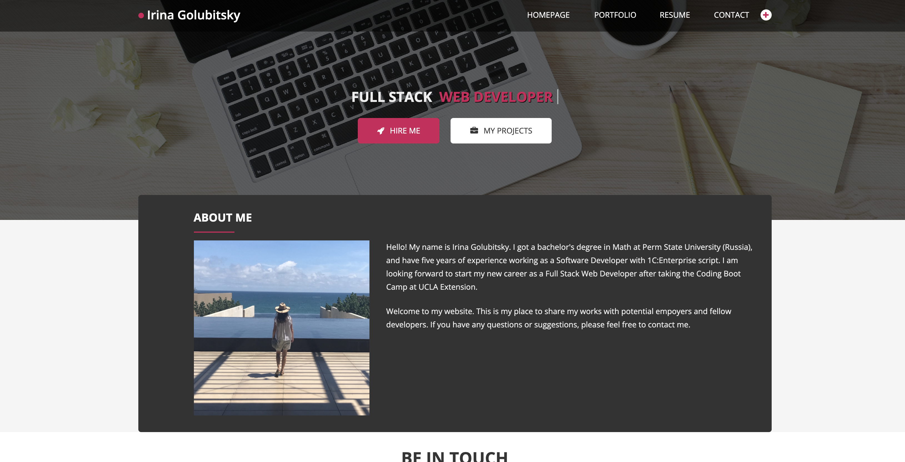

# react-portfolio[](https://opensource.org/licenses/MIT)
​
My React portfolio of work samples.
​
## Technologies Used

* React.js 


## Description 

Being a web developer means being part of a community. This app is my place to share my projects with potential empoyers and fellow developers

USER STORY
```
AS AN employer looking for candidates with experience building single-page applications
I WANT to view a potential employee's deployed React portfolio of work samples
SO THAT I can assess whether they're a good candidate for an open position
```
## Table of Contents 
- [Deployed](#deployed)
- [License](#license)
- [ScreenShot](#screenshot)
- [Questoins](#questions)

## Deployed

https://irina-golubitsky.herokuapp.com/


## License 
  
  The MIT License


## ScreenShot
  
   |  
   
## Questions
If you hane any questions:
  
  Get in touch with me on Github [Irina-Golubitsky](https://github.com/Irina-Golubitsky)
  
  Email me irina.golubitsky@gmail.com
